# neuOS Project Architecture Documentation

## Project Overview

neuOS is an interactive web-based operating system interface that serves as a portfolio for Jared U., a senior network engineer. The project implements a modern, glassmorphic UI design with advanced audio-visual effects, particle systems, and a terminal-based interface.

### Technology Stack
- **Frontend**: HTML5, CSS3, JavaScript ES6+
- **Audio**: Howler.js library for audio management
- **PWA**: Service Worker for offline functionality
- **Graphics**: Canvas API for starfield background
- **Effects**: CSS filters, SVG filters, and custom animations

## Project Structure

```
jaredu3077.github.io/
├── index.html                 # Main entry point
├── sw.js                      # Service Worker for PWA
├── css/                       # Stylesheets (12 files)
│   ├── design-tokens.css      # Design system tokens
│   ├── glass.css              # Glassmorphic effects
│   ├── window-base.css        # Window management styles
│   ├── terminal.css           # Terminal application styles
│   ├── desktop.css            # Desktop layout
│   ├── animations.css         # Animation definitions
│   ├── responsive.css         # Responsive design
│   ├── mobile.css             # Mobile-specific styles
│   ├── apps.css               # Application-specific styles
│   ├── theme.css              # Theme management
│   ├── terminal-icon.css      # Terminal icon styles
│   └── login.css              # Login screen styles
├── js/                        # JavaScript modules
│   ├── main.js                # Application entry point
│   ├── config.js              # Configuration management
│   ├── howler.min.js          # Audio library
│   ├── core/                  # Core system modules (20 files)
│   │   ├── boot.js            # Boot sequence management
│   │   ├── window.js          # Window management system
│   │   ├── glassEffect.js     # Glassmorphic effects
│   │   ├── particleSystem.js  # Particle system
│   │   ├── audioSystem.js     # Audio management
│   │   ├── themeManager.js    # Theme management
│   │   ├── screensaver.js     # Screensaver functionality
│   │   ├── backgroundMusic.js # Background music system
│   │   ├── resizeHandler.js   # Window resize handling
│   │   ├── dragHandler.js     # Drag and drop handling
│   │   ├── snapHandler.js     # Window snapping
│   │   ├── autoScrollHandler.js # Auto-scroll functionality
│   │   ├── bootSequence.js    # Boot sequence logic
│   │   ├── animationMixin.js  # Animation mixin
│   │   ├── backgroundMixin.js # Background mixin
│   │   ├── controlMixin.js    # Control mixin
│   │   ├── generationMixin.js # Generation mixin
│   │   ├── interactionMixin.js # Interaction mixin
│   │   ├── mouseMixin.js      # Mouse mixin
│   │   ├── modeMixin.js       # Mode mixin
│   │   ├── particleCreationMixin.js # Particle creation mixin
│   │   └── data/              # Data files
│   │       └── solarSystemData.js # Solar system data
│   ├── apps/                  # Application modules
│   │   └── terminal/          # Terminal application (11 files)
│   │       ├── terminal.js    # Main terminal logic
│   │       ├── content.js     # Terminal content management
│   │       ├── eventHandlers.js # Terminal event handling
│   │       ├── outputUtils.js # Output formatting utilities
│   │       ├── filesystem.js  # File system simulation
│   │       ├── environment.js # Environment variables
│   │       ├── history.js     # Command history
│   │       ├── audio.js       # Terminal audio
│   │       ├── theme.js       # Terminal theming
│   │       ├── statusBar.js   # Status bar functionality
│   │       └── commands/      # Command implementations (8 files)
│   │           ├── commands.js # Main command system
│   │           ├── core.js     # Core commands
│   │           ├── network.js  # Network commands
│   │           ├── cisco.js    # Cisco-specific commands
│   │           ├── system.js   # System commands
│   │           ├── effects.js  # Visual effects commands
│   │           ├── appControl.js # Application control
│   │           └── environment.js # Environment commands
│   └── utils/                 # Utility modules (6 files)
│       ├── draggable.js       # Drag and drop functionality
│       ├── mobile.js          # Mobile utilities
│       ├── mechvibes.js       # Mechanical keyboard sounds
│       ├── utils.js           # General utilities
│       ├── glassEffects.js    # Glass effect utilities
│       └── help.js            # Help system
├── config/                    # Configuration files
│   ├── config.json            # Application configuration
│   └── manifest.json          # PWA manifest
├── assets/                    # Static assets
│   ├── audio/                 # Audio files
│   │   ├── mp3.mp3           # Background music
│   │   └── sound.ogg         # Sound effects
│   └── content/               # Content files
│       └── resume.txt         # Resume content
└── docs/                      # Documentation
    ├── index.md               # HTML entry point documentation
    ├── main.md                # JavaScript entry point documentation
    ├── config.md              # Configuration system documentation
    ├── sw.md                  # Service worker documentation
    ├── architecture.md        # This file - overall architecture
    ├── DOTHISNEXT.md         # Issues requiring attention
    ├── THEMING_STANDARDIZATION.md # Theming system documentation
    └── README.md              # Project overview
```

## Dependency Graph

### Core Dependencies

```mermaid
graph TD
    A[index.html] --> B[main.js]
    B --> C[config.js]
    B --> D[core/boot.js]
    B --> E[core/window.js]
    B --> F[core/glassEffect.js]
    B --> G[core/particleSystem.js]
    B --> H[core/audioSystem.js]
    B --> I[core/themeManager.js]
    B --> J[apps/terminal/terminal.js]
    B --> K[utils/draggable.js]
    B --> L[utils/mobile.js]
    B --> M[utils/mechvibes.js]
    B --> N[utils/utils.js]
    B --> O[utils/glassEffects.js]
    B --> P[utils/help.js]
    
    J --> Q[apps/terminal/commands/commands.js]
    J --> R[apps/terminal/content.js]
    J --> S[apps/terminal/eventHandlers.js]
    J --> T[apps/terminal/outputUtils.js]
    J --> U[apps/terminal/filesystem.js]
    J --> V[apps/terminal/environment.js]
    J --> W[apps/terminal/history.js]
    J --> X[apps/terminal/audio.js]
    J --> Y[apps/terminal/theme.js]
    J --> Z[apps/terminal/statusBar.js]
    
    Q --> AA[apps/terminal/commands/core.js]
    Q --> BB[apps/terminal/commands/network.js]
    Q --> CC[apps/terminal/commands/cisco.js]
    Q --> DD[apps/terminal/commands/system.js]
    Q --> EE[apps/terminal/commands/effects.js]
    Q --> FF[apps/terminal/commands/appControl.js]
    Q --> GG[apps/terminal/commands/environment.js]
    
    A --> HH[css/design-tokens.css]
    A --> II[css/glass.css]
    A --> JJ[css/window-base.css]
    A --> KK[css/terminal.css]
    A --> LL[css/desktop.css]
    A --> MM[css/animations.css]
    A --> NN[css/responsive.css]
    A --> OO[css/mobile.css]
    A --> PP[css/apps.css]
    A --> QQ[css/theme.css]
    A --> RR[css/terminal-icon.css]
    A --> SS[css/login.css]
    
    A --> TT[config/manifest.json]
    A --> UU[config/config.json]
    A --> VV[assets/audio/mp3.mp3]
    A --> WW[assets/audio/sound.ogg]
    A --> XX[assets/content/resume.txt]
    
    A --> YY[sw.js]
    YY --> ZZ[Browser Cache API]
```



## Load Order and Initialization

### 1. HTML Document Loading
- Browser parses `index.html`
- CSS files loaded in sequence (design-tokens → glass → window-base → terminal → desktop → animations → responsive → mobile → apps → theme → terminal-icon → login)
- JavaScript modules loaded via ES6 imports

### 2. JavaScript Module Initialization
```javascript
// Main entry point (main.js)
import { Terminal } from './apps/terminal/terminal.js';
import { WindowManager } from './core/window.js';
import { HelpManager } from './utils/help.js';
import { BootSystem } from './core/boot.js';
import { CONFIG, createAppButton } from './config.js';
```

### 3. Core Systems Initialization Order
1. **Boot System** (`core/boot.js`) - Handles startup sequence
2. **Window Manager** (`core/window.js`) - Manages application windows
3. **Glass Effect System** (`core/glassEffect.js`) - Applies glassmorphic effects
4. **Particle System** (`core/particleSystem.js`) - Manages background particles
5. **Audio System** (`core/audioSystem.js`) - Handles audio playback
6. **Theme Manager** (`core/themeManager.js`) - Manages UI themes
7. **Draggable System** (`utils/draggable.js`) - Enables drag and drop
8. **Mobile Utilities** (`utils/mobile.js`) - Mobile-specific functionality

## Data Flow Architecture

### User Interaction Flow
```
User Action → Event Listener → Handler Function → State Update → UI Update
```

### Application Launch Flow
```
Desktop Icon Click → handleAppClick() → WindowManager.createWindow() → App Initialization → Window Display
```

### Terminal Command Flow
```
User Input → Terminal Event Handler → Command Parser → Command Execution → Output Formatting → Display
```

### Audio System Flow
```
Audio Event → AudioSystem → Howler.js → Browser Audio API → Audio Output
```

### Particle System Flow
```
Animation Frame → ParticleSystem → Canvas Context → Visual Effects
```

### Service Worker Flow
```
Network Request → Service Worker → Cache Check → Network Request → Cache Update → Response
```

## Module Relationships

### Core System Dependencies
- **WindowManager** depends on: `utils/draggable.js`, `core/glassEffect.js`
- **BootSystem** depends on: `core/audioSystem.js`, `core/particleSystem.js`
- **GlassEffect** depends on: `utils/glassEffects.js`
- **ParticleSystem** depends on: `core/backgroundMixin.js`, `core/generationMixin.js`

### Application Dependencies
- **Terminal** depends on: `apps/terminal/commands/*.js`, `utils/help.js`
- **All Apps** depend on: `core/window.js`, `config.js`

### Utility Dependencies
- **Draggable** depends on: `utils/utils.js`
- **Mobile** depends on: `utils/utils.js`
- **Mechvibes** depends on: `js/howler.min.js`

### Service Worker Dependencies
- **Service Worker** manages: All static assets, audio files, configuration files
- **Cache Strategy** implements: Cache-first for static assets, network-first for documents

## Standards Compliance

### HTML5 Standards
- ✅ Semantic HTML elements (`<main>`, `<section>`, `<nav>`)
- ✅ ARIA attributes for accessibility
- ✅ Meta tags for SEO and PWA
- ✅ Content Security Policy headers
- ✅ Structured data (JSON-LD)

### CSS3 Standards
- ✅ CSS Custom Properties (variables)
- ✅ Flexbox and Grid layouts
- ✅ Media queries for responsive design
- ✅ CSS animations and transitions
- ✅ CSS filters and transforms

### JavaScript ES6+ Standards
- ✅ ES6 modules (import/export)
- ✅ Arrow functions
- ✅ Template literals
- ✅ Destructuring assignment
- ✅ Async/await for asynchronous operations
- ✅ Class syntax for object-oriented programming

### PWA Standards
- ✅ Service Worker implementation
- ✅ Web App Manifest
- ✅ Offline functionality
- ✅ Cache strategies
- ✅ Background sync support

## Performance Considerations

### Loading Optimization
- CSS files loaded in dependency order with design tokens first
- JavaScript modules use ES6 imports for tree-shaking
- Audio files preloaded for immediate playback
- Service Worker for caching and offline functionality

### Runtime Performance
- Particle system uses requestAnimationFrame for smooth animations
- Debounced event handlers for resize and scroll events
- Lazy loading of application content
- Efficient DOM manipulation with querySelector

### Caching Performance
- Static assets cached for offline use
- Dynamic content cached with network-first strategy
- Cache size management and cleanup
- Background sync for updates

## Security Features

### Content Security Policy
- Restricted script sources to 'self' and 'unsafe-inline'
- Restricted style sources to 'self' and 'unsafe-inline'
- Restricted image sources to 'self' and data URIs
- Restricted font sources to 'self'

### XSS Protection
- X-Content-Type-Options: nosniff
- X-XSS-Protection: 1; mode=block
- Input sanitization in terminal commands
- Safe DOM manipulation practices

### Service Worker Security
- Origin-restricted service worker
- Secure cache management
- Request filtering and validation
- Error handling and logging

## Accessibility Features

### ARIA Implementation
- Proper ARIA labels and descriptions
- Live regions for dynamic content
- Focus management for keyboard navigation
- Screen reader announcements

### Keyboard Navigation
- Tab order management
- Keyboard shortcuts for applications
- Focus indicators for interactive elements
- Escape key handling for modals

## Browser Compatibility

### Supported Browsers
- Chrome 80+
- Firefox 75+
- Safari 13+
- Edge 80+

### Feature Detection
- Service Worker availability
- ES6 module support
- Canvas API support
- Audio API support
- CSS Grid support

## Development Guidelines

### Code Organization
- Modular architecture with clear separation of concerns
- ES6 modules for dependency management
- Consistent naming conventions
- Comprehensive error handling

### Documentation Standards
- JSDoc comments for all functions
- README files for major components
- Inline comments for complex logic
- Architecture diagrams for system relationships

### Testing Considerations
- Unit tests for utility functions
- Integration tests for core systems
- Cross-browser compatibility testing
- Performance benchmarking

## Issues and Improvements

### Identified Issues
See [DOTHISNEXT.md](DOTHISNEXT.md) for a comprehensive list of issues requiring attention, including:

- **HTML Issues**: Missing semantic elements, inline styles
- **CSS Issues**: Large files, high specificity, performance concerns
- **JavaScript Issues**: Large files, tight coupling, performance issues
- **Architecture Issues**: Global state pollution, error handling
- **Security Issues**: CSP restrictions, input validation
- **Performance Issues**: Module loading, cache management

### Recommended Actions
1. **Immediate**: Split large files into smaller, focused modules
2. **High Priority**: Implement proper semantic HTML structure
3. **Medium Priority**: Optimize CSS for better performance
4. **Low Priority**: Add comprehensive accessibility features
5. **Ongoing**: Implement automated testing for all modules

## Related Documentation

- [index.md](index.md) - HTML entry point documentation
- [main.md](main.md) - JavaScript entry point documentation
- [config.md](config.md) - Configuration system documentation
- [sw.md](sw.md) - Service worker documentation
- [DOTHISNEXT.md](DOTHISNEXT.md) - Issues requiring attention
- [THEMING_STANDARDIZATION.md](THEMING_STANDARDIZATION.md) - Theming system documentation 